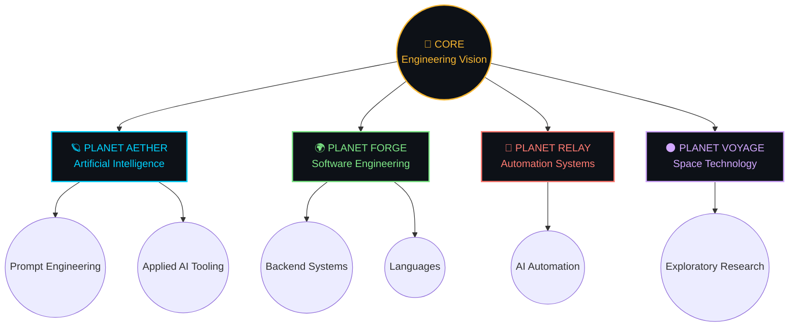
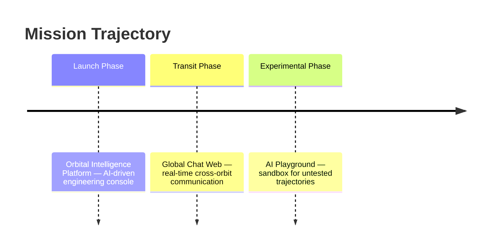
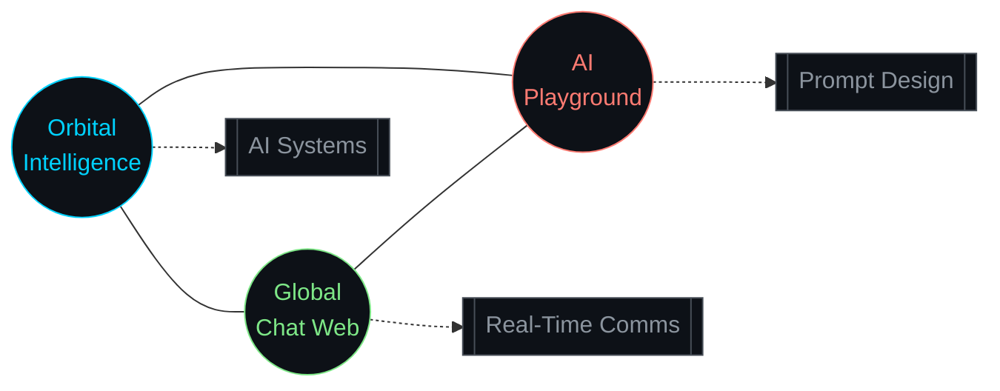

<div align="center">

```
┌──────────────────────────────────────────────────────────────────┐
│  DEEP SPACE NETWORK  ·  INCOMING TRANSMISSION  ·  SIGNAL LOCKED  │
│  SOURCE: UNKNOWN SECTOR  →  DESTINATION: github.com/Aswinsudhan  │
└──────────────────────────────────────────────────────────────────┘
```

# ⟨ THE ASWINSUDHAN UNIVERSE ⟩
### * Solar system of code, cognition & curiosity*

`STATUS: ONLINE`&nbsp;&nbsp;·&nbsp;&nbsp;`ROLE: ENGINEERING STUDENT`&nbsp;&nbsp;·&nbsp;&nbsp;`ORBIT: AI × SOFTWARE × SPACE`

[Solar Map](#-solar-map--the-architecture-of-this-universe) ·
[Planetary Network](#-planetary-network) ·
[Asteroid Belt](#-asteroid-belt--technologies-in-orbit) ·
[Missions](#-active-comet-trajectories--current-missions) ·
[Constellation](#-knowledge-constellation--repository-star-map) ·
[Telemetry](#-deep-space-telemetry) ·
[Mission Control](#-mission-control--transmission-channels)

</div>

<br>

## 🛰️ IGNITION POINT

> Every universe begins with a single point of unreasonable energy.
> Mine began with a question: *if intelligence can be engineered, what else can be?*
> Everything below is what happens when that question is given a compiler, a terminal, and no deadline.

<br>

## ✦ SOLAR MAP — The Architecture of This Universe

Unlike most engineering profiles that list skills top to bottom, this universe is built on **orbital distance** — the closer a body sits to the core, the more it defines how I think.



<div align="center">

| Celestial Body | Domain | Orbital Distance | Signal Strength |
|:---|:---|:---:|:---:|
| 🌟 **Core** | Engineering Vision | `0.0 AU` | `████████████` |
| 🪐 **Aether** | Artificial Intelligence | `0.4 AU` | `██████████##` |
| 🌍 **Forge** | Software Engineering | `1.0 AU` | `███████████#` |
| 🔴 **Relay** | Automation | `1.5 AU` | `████████####` |
| 🌑 **Voyage** | Space Technology | `2.2 AU` | `██████######` |

</div>

<br>

## 🪐 PLANETARY NETWORK

Each planet in this system has its own moons — the tools that keep it in orbit.

<details>
<summary><b>🪐 PLANET AETHER — Artificial Intelligence</b></summary>
<br>

Aether is the planet where language becomes logic. This is where I design conversations *with* machines instead of just instructions *for* them.

**Moons in orbit:**

| Moon | Function |
|:---|:---|
| `ChatGPT` | Reasoning partner, architecture sparring |
| `Google Gemini` | Multimodal exploration |
| `Replit AI` | In-flight code co-navigation |
| `Prompt Engineering` | The gravity that holds the system together |
| `AI Automation` | Turning intent into pipelines |

</details>

<details>
<summary><b>🌍 PLANET FORGE — Software Engineering</b></summary>
<br>

Forge is the industrial planet — where ideas get smelted into working systems.

**Moons in orbit:**

| Moon | Function |
|:---|:---|
| `Python` | The atmosphere — I breathe it first |
| `C` / `C++` | The bedrock — how the planet's core was formed |
| `JavaScript` | The weather system — always shifting, always visible |
| `Node.js` | Engine room |
| `REST APIs` | Communication satellites between systems |
| `MongoDB` | The planet's memory core |

</details>

<details>
<summary><b>🔴 PLANET RELAY — Automation</b></summary>
<br>

Relay exists so that nothing has to happen twice. If a task repeats, Relay intercepts it before it reaches me.

**Moons in orbit:**

| Moon | Function |
|:---|:---|
| `AI-assisted scripting` | Removing repetition from the workflow |
| `Workflow pipelines` | Systems that run themselves |

</details>

<details>
<summary><b>🌑 PLANET VOYAGE — Space Technology</b></summary>
<br>

Voyage is the farthest planet — the one I'm still sending probes toward. Space technology isn't a hobby here, it's the horizon.

**Moons in orbit:**

| Moon | Function |
|:---|:---|
| `Research & Curiosity` | Reading further than the syllabus asks |
| `Systems Thinking` | Borrowing aerospace rigor for software design |

</details>

<br>

## ☄️ ASTEROID BELT — Technologies in Orbit

Not every fragment is a planet. Some technologies are smaller, faster-moving, and just as essential — the asteroid belt of my stack.

<div align="center">

<table>
<tr>
<td valign="top" width="33%">

**Languages**
```
Python     ●●●●●●●●●●
C/C++      ●●●●●●●●##
JavaScript ●●●●●●####
```

</td>
<td valign="top" width="33%">

**Backend Field**
```
Node.js    ●●●●●●●●##
REST API   ●●●●●●●●●#
MongoDB    ●●●●●●●###
```

</td>
<td valign="top" width="33%">

**AI Toolkit**
```
Prompt Eng ●●●●●●●●●●
ChatGPT    ●●●●●●●●●●
Gemini     ●●●●●●●###
```

</td>
</tr>
</table>

</div>

<br>

## 🛰️ ACTIVE COMET TRAJECTORIES — Current Missions

Comets don't stay still — they pass through, leave a trail, and come back changed. These are the projects currently burning through my system.



<div align="center">

| 🛰️ Mission | Payload | Trajectory Stack | Status |
|:---|:---|:---|:---:|
| **Orbital Intelligence Platform** | Applied AI systems for engineering decision-making | `Python` `AI Tooling` `Automation` | `🟢 IN ORBIT` |
| **Global Chat Web** | Real-time communication across the system | `Node.js` `MongoDB` `REST API` | `🟢 IN ORBIT` |
| **AI Playground** | Experimental ground for untested prompt architectures | `Prompt Engineering` `JavaScript` | `🟡 EXPERIMENTAL` |

</div>

<br>

## 🌌 KNOWLEDGE CONSTELLATION — Repository Star Map

Repositories aren't a list here — they're stars, connected by the ideas that link them.



<br>

## ⬤ BLACK HOLE LOG — Where Problems Collapse Into Solutions

*A black hole doesn't destroy — it compresses chaos into something dense enough to matter.*

```
[LOG 001]  SYSTEM: Global Chat Web
           EVENT:  Message state desynchronization under concurrent load
           ACTION: Restructured data flow through MongoDB + REST layer
           RESULT: Stable real-time sync across clients
           ────────────────────────────────────────────

[LOG 002]  SYSTEM: Orbital Intelligence Platform
           EVENT:  AI output inconsistency across prompt variations
           ACTION: Engineered structured prompt architecture + guardrails
           RESULT: Predictable, repeatable AI responses
```

<br>

## 🌠 NEBULA INCUBATOR — Future Ideas Forming

Nebulae are stars that haven't ignited yet. These are mine.

- `◆` Autonomous engineering agents that self-correct without supervision
- `◆` A unified AI + automation layer connecting all Forge-class projects
- `◆` Deeper exploration into space-tech-adjacent software systems

<br>

## 📡 DEEP SPACE TELEMETRY

<div align="center">


</div>

<br>

## 🛸 MISSION CONTROL — Transmission Channels

<div align="center">

| Channel | Frequency |
|:---:|:---:|
| 📡 Email | [aswinharisudhan@gmail.com](mailto:aswinharisudhan@gmail.com) |
| 🛰️ LinkedIn | [aswinsudhank](https://www.linkedin.com/in/aswinsudhank/) |
| 🌌 GitHub | [Aswinsudhan](https://github.com/Aswinsudhan) |
| 📷 Instagram | [im_axw1n](https://www.instagram.com/im_axw1n/) |

</div>

<br>

<div align="center">

```
┌──────────────────────────────────────────────────────────────────┐
│  END OF TRANSMISSION  ·  SIGNAL WILL RETURN  ·  ORBIT CONTINUES  │
└──────────────────────────────────────────────────────────────────┘
```

*This universe is still expanding.*

</div>
